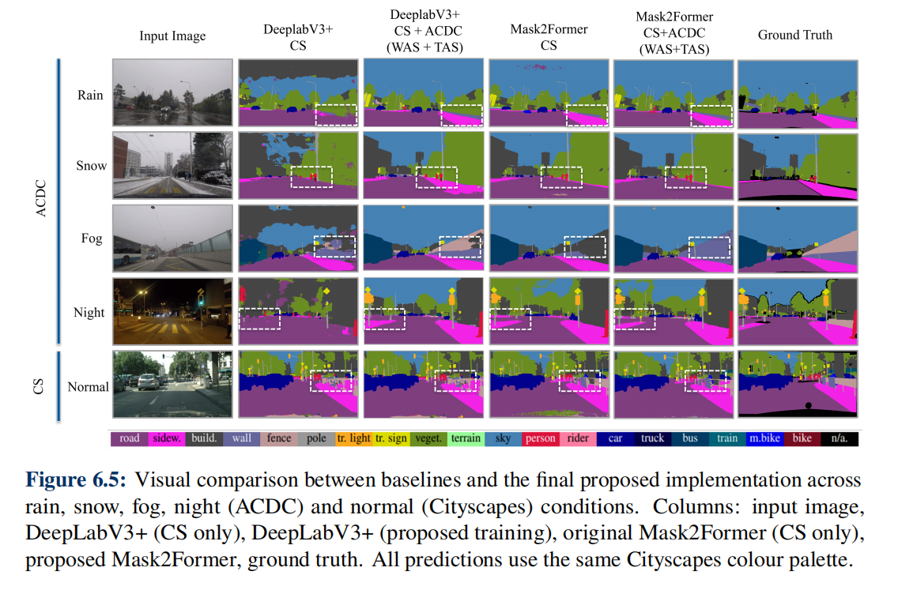
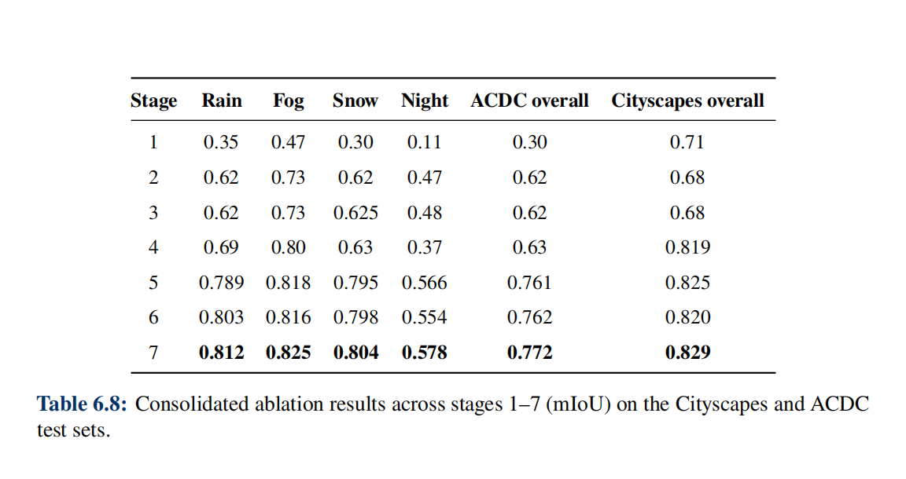

# Transformer-Based Semantic Segmentation for Autonomous Driving in Adverse Weather

This repository contains the code and experimental setup for my Master’s thesis:

> **Transformer-Based Semantic Segmentation for Autonomous Driving in Adverse Weather Conditions Using Weather- and Time-Aware Supervision**
> Technische Hochschule Ingolstadt – International Automotive Engineering
> Author: **Shiv Chaudhary**

The work is conceptually based on the DeepLabV3+-based pipeline of
**Semantic Segmentation under Adverse Conditions: A Weather- and Nighttime-aware Synthetic Data-based Approach** (Kerim et al.)
but replaces DeepLabV3+ with **Mask2Former (Swin-L)** and focuses on **real-world** adverse conditions (**Cityscapes + ACDC**), not synthetic AWSS.

---

## Contents

* [Core ideas](#core-ideas)
* [Repository structure](#repository-structure)
* [1. Environment setup](#1-environment-setup)
* [2. Datasets](#2-datasets)
* [3. Checkpoints (pretrained models)](#3-checkpoints-pretrained-models)
* [4. Training](#4-training)
* [5. Evaluation / inference](#5-evaluation--inference)
* [6. Assets (figures used in the thesis)](#6-assets-figures-used-in-the-thesis)
* [7. Reproducing the main thesis experiments](#7-reproducing-the-main-thesis-experiments)
* [8. Acknowledgements](#8-acknowledgements)

---

## Core ideas

* Train **one Mask2Former model** that stays robust across:

  * clear-weather scenes (**Cityscapes**)
  * adverse conditions (**ACDC**: rain, fog, snow, night)
* Use **alternate-batch training**: Cityscapes → ACDC → Cityscapes → ACDC → …
* Use **Weather-Aware Supervisor (WAS)** and **Time-Aware Supervisor (TAS)** heads for multi-task learning (weather & time-of-day classification).
* Apply **selective encoder freezing** to preserve clear-weather features while adapting to adverse conditions, and study the impact through ablations.

<p align="center">
  
</p>

<p align="center">
  <i>Qualitative comparison between baseline models and the final proposed Mask2Former-based method under adverse conditions.</i>
</p>

---

## Repository structure

```text
Master-Thesis_semantic-adverse-segmentation-thesis/
├── LICENSE
├── README.md
├── environment.yml          # Conda environment (exported from working setup)
├── requirements.txt         # pip-style dependencies (same env as above)
└── mask2former_/            # Main thesis code
    ├── Scripts_Extra/       # Extra experiment scripts / ablations
    ├── artifacts/
    │   └── splits/
    ├── assets/              # Figures used in the thesis (bar charts, samples, etc.)
    ├── checkpoints/         # Expected location for .pth files (ignored by git)
    ├── datasets/            # Dataset wrappers (Cityscapes + ACDC)
    ├── metrics/             # StreamSegMetrics (mIoU, etc.)
    ├── models/              # WAS/TAS auxiliary heads
    ├── network/             # Mask2Former model wrapper
    ├── utils/               # Transforms, losses, schedulers, visualizer
    └── main_mask2former_WAS_TAS_ON_1.0.py   # Main training / eval script
````

> [!NOTE]
> `mask2former_/checkpoints/` is intentionally ignored in `.gitignore` because model files are large.
> Download checkpoints separately (see below) or train from scratch.

---

## 1. Environment setup

The experiments were run in a Conda environment with:

* **Python 3.8**
* **PyTorch with CUDA** (GPU strongly recommended)
* **Hugging Face Transformers** (Mask2Former implementation)
* Common vision libraries (numpy, tqdm, opencv-python, Pillow, matplotlib, etc.)

### Option A: Conda from `environment.yml` (recommended)

```bash
conda env create -f environment.yml
conda activate mask2former-adverse  # or the name defined inside the yml
```

### Option B: Create manually + pip from `requirements.txt`

```bash
conda create -n mask2former-adverse python=3.8 -y
conda activate mask2former-adverse
pip install -r requirements.txt
```

### Minimal manual install (if you do not want full exported env)

> [!TIP]
> The CUDA wheel version should match your local CUDA / driver setup.

```bash
pip install torch torchvision torchaudio --index-url https://download.pytorch.org/whl/cu118
pip install transformers timm tqdm opencv-python pillow matplotlib
```

---

## 2. Datasets

This project uses only **real-world** datasets:

* **Cityscapes** – clear-weather urban scenes (daytime)
* **ACDC** – Adverse Conditions Dataset with Correspondences (rain, fog, snow, night)

### 2.1 Download

You must request both datasets from their official websites and agree to their licenses.

A typical extracted layout:

```text
/path/to/datasets/
├── cityscapes/
│   ├── leftImg8bit/
│   │   ├── train/
│   │   └── val/
│   └── gtFine/
│       ├── train/
│       └── val/
└── ACDC/
    ├── rgb_anon/
    │   ├── train/
    │   └── val/
    └── gt/
        ├── train/
        └── val/
```

### 2.2 Tell the code where the datasets are

The main script uses explicit paths:

* `opts.data_root_cs` → Cityscapes root
* `opts.data_root_acdc` → ACDC root

#### Option A: Set environment variables

```bash
export CS_ROOT=/path/to/datasets/cityscapes
export ACDC_ROOT=/path/to/datasets/ACDC
```

#### Option B: Pass paths via CLI arguments

```bash
--data_root_cs /path/to/datasets/cityscapes \
--data_root_acdc /path/to/datasets/ACDC
```

The dataset code expects **19 Cityscapes classes** and applies compatible mappings for ACDC.

---

## 3. Checkpoints (pretrained models)

Large `.pth` files are hosted on Google Drive:

Google Drive folder (all checkpoints):
[https://drive.google.com/drive/folders/1NJkVJxFCGNzdk71pG4HeZQxVVC3VWS02?usp=drive_link](https://drive.google.com/drive/folders/1NJkVJxFCGNzdk71pG4HeZQxVVC3VWS02?usp=drive_link)

> [!IMPORTANT]
The Drive folder also contains a `commands_ablation_stages_4_to_6.txt` file with the full training/evaluation commands for non-final ablation runs.

### 3.1 Expected filenames

Download the files and place them in:

```text
mask2former_/checkpoints/
```

Ablation Stage 4 — Cityscapes-only baseline (Mask2Former)

best_mask2former_cityscapes_only_os16.pth
Script: mask2former_/Scripts_Extra/main_mask2former_cityscapes_only.py
About: Cityscapes-only Mask2Former baseline (no ACDC). Used to measure clear-weather performance before any adverse-condition adaptation.

Ablation Stage 5 — Mixed-dataset on original Mask2Former (segmentation-only)

mixdataset_on_original_mask2former_segonly_best.pth
Script: mask2former_/Scripts_Extra/mixdataset_on_original_mask2former.py
About: Ablation experiment that runs mixed-dataset training/inference using the original Mask2Former segmentation-only setup, to study domain mixing effects before introducing WAS/TAS or selective encoder freezing.

Ablation Stage 6 — Segmentation-only CS + ACDC (no WAS/TAS)

main_mask2former_segonly_acdc_cs_alt_best.pth
Script: mask2former_/Scripts_Extra/main_mask2former_segonly_acdcfirst.py (and related seg-only scripts in Scripts_Extra/)
About: Segmentation-only alternate-batch training on Cityscapes + ACDC (no WAS/TAS supervision). This isolates the benefit of alternate-batch learning without auxiliary heads.

Ablation Stage 7 — Final thesis model (CS + ACDC + WAS/TAS)

best_mask2former_WAS_TAS_ON_1.0.pth
Script: mask2former_/main_mask2former_WAS_TAS_ON_1.0.py
About: Final proposed model trained with alternate-batch Cityscapes + ACDC, selective encoder freezing, and WAS/TAS auxiliary supervision (main thesis contribution).

---

## 4. Training

Main script for the final CS+ACDC model:

```text
mask2former_/main_mask2former_WAS_TAS_ON_1.0.py
```

For full alternate-batch CS+ACDC training with WAS/TAS:

```bash
cd mask2former_

CUDA_VISIBLE_DEVICES=0 \
python main_mask2former_WAS_TAS_ON_1.0.py \
  --mode 0 \
  --dataset cityscapes_ACDC \
  --data_root_cs   "$CS_ROOT" \
  --data_root_acdc "$ACDC_ROOT" \
  --cs_split_strategy train85_val15_only_train_split \
  --cs_holdout_seed 1 \
  --num_classes 19 \
  --output_stride 16 \
  --crop_size 640 \
  --batch_size 3 \
  --val_batch_size 1 \
  --total_itrs 90000 \
  --lr 1e-5 \
  --loss_type cross_entropy \
  --ws_weight 1e-5 \
  --tes_weight 1e-5 \
  --per_condition_val \
  --enable_vis --vis_port 13570 --vis_env main
```
> [!IMPORTANT]
> The training command shown in **Section 4** corresponds to **Ablation Stage 7 (Final thesis model)** only  
> (i.e., the final CS+ACDC model with WAS/TAS and selective encoder freezing).
>
> Commands for running **all other ablation stages (Stages 4–6)** are provided separately as a **text file in Google Drive**  
> (see the Drive folder in Section 3) to keep this README focused on the final reproducible setup.

### Key behaviour

* **Mode 0** → 1:1 alternate-batch training on **Cityscapes + ACDC**
* **Encoder freezing strategy**

  * ACDC batches: encoder fully trainable
  * Cityscapes batches: low-level encoder blocks frozen; higher layers trainable
* **WAS/TAS supervision**

  * Weather and time-of-day heads are trained as auxiliary tasks
  * `ws_weight` and `tes_weight` are small (e.g. `1e-5`) so segmentation dominates

---

## 5. Evaluation / inference

Additional scripts under `mask2former_/Scripts_Extra/` are used for ablations and test-only runs.

### 5.1 Final thesis model (WAS+TAS) – evaluation commands

All evaluations below use:

```text
checkpoints/best_mask2former_WAS_TAS_ON_1.0.pth
```
> [!IMPORTANT]
> All evaluation commands in **Section 5.1** are for **Ablation Stage 7 (Final thesis model)** only  
> using `checkpoints/best_mask2former_WAS_TAS_ON_1.0.pth`.
>
> Evaluation/training commands for **Stages 4–6** are stored as a **text file in Google Drive**  
> (see the Drive folder in Section 3).

> [!NOTE]
> The evaluation prints **mean IoU (mIoU)** and **per-class IoU** using the standard **19-class Cityscapes taxonomy**.

#### (1) Cityscapes (overall)

```bash
cd mask2former_

CUDA_VISIBLE_DEVICES=0 \
python main_mask2former_WAS_TAS_ON_1.0.py \
  --mode 11 \
  --dataset cityscapes \
  --test_batch_size 3 \
  --num_classes 19 \
  --output_stride 16 \
  --crop_size 640 \
  --ckpt checkpoints/best_mask2former_WAS_TAS_ON_1.0.pth
```

#### (2) ACDC (overall)

```bash
cd mask2former_

CUDA_VISIBLE_DEVICES=0 \
python main_mask2former_WAS_TAS_ON_1.0.py \
  --mode 21 \
  --dataset ACDC \
  --test_batch_size 3 \
  --num_classes 19 \
  --output_stride 16 \
  --crop_size 640 \
  --ckpt checkpoints/best_mask2former_WAS_TAS_ON_1.0.pth
```

#### (3) ACDC – Rain

```bash
cd mask2former_

CUDA_VISIBLE_DEVICES=0 \
python main_mask2former_WAS_TAS_ON_1.0.py \
  --mode 21 \
  --dataset ACDC \
  --ACDC_test_class rain \
  --test_batch_size 3 \
  --num_classes 19 \
  --output_stride 16 \
  --crop_size 640 \
  --ckpt checkpoints/best_mask2former_WAS_TAS_ON_1.0.pth
```

#### (4) ACDC – Fog

```bash
cd mask2former_

CUDA_VISIBLE_DEVICES=0 \
python main_mask2former_WAS_TAS_ON_1.0.py \
  --mode 21 \
  --dataset ACDC \
  --ACDC_test_class fog \
  --test_batch_size 3 \
  --num_classes 19 \
  --output_stride 16 \
  --crop_size 640 \
  --ckpt checkpoints/best_mask2former_WAS_TAS_ON_1.0.pth
```

#### (5) ACDC – Snow

```bash
cd mask2former_

CUDA_VISIBLE_DEVICES=0 \
python main_mask2former_WAS_TAS_ON_1.0.py \
  --mode 21 \
  --dataset ACDC \
  --ACDC_test_class snow \
  --test_batch_size 3 \
  --num_classes 19 \
  --output_stride 16 \
  --crop_size 640 \
  --ckpt checkpoints/best_mask2former_WAS_TAS_ON_1.0.pth
```

#### (6) ACDC – Night

```bash
cd mask2former_

CUDA_VISIBLE_DEVICES=0 \
python main_mask2former_WAS_TAS_ON_1.0.py \
  --mode 21 \
  --dataset ACDC \
  --ACDC_test_class night \
  --test_batch_size 3 \
  --num_classes 19 \
  --output_stride 16 \
  --crop_size 640 \
  --ckpt checkpoints/best_mask2former_WAS_TAS_ON_1.0.pth
```

---

### 5.2 Pure inference script (saves outputs, no mIoU computation)

Inference-only script:

```text
mask2former_/Scripts_Extra/run_acdc_actual_adverse.py
```

Example run:

```bash
cd mask2former_

CUDA_VISIBLE_DEVICES=0 \
python Scripts_Extra/run_acdc_actual_adverse.py \
  --dataset ACDC \
  --num_classes 19 \
  --output_stride 16 \
  --crop_size 640 \
  --ckpt checkpoints/best_mask2former_WAS_TAS_ON_1.0.pth
```

> This script is intended for **pure inference** (saving qualitative outputs) and is kept separate from the evaluation commands above.

---

## 6. Assets (figures used in the thesis)

The folder `mask2former_/assets/` contains figures used in the thesis:

* `barchart_comparison_deeplabv3plus_vs_mask2former_on_cityscapes.png`
* `barchart_comparison_deeplabv3plus_vs_mask2former_on_acdc.png`
* `figure_qualitative_comparison_between_baselines_and_final_proposed_method.png`
* `table_consolidated_ablation_results_stage_1_to_7_miou_cityscapes_acdc.png`

---

## 7. Reproducing the main thesis experiments

High-level summary of the main setups:

### Cityscapes-only baseline (Mask2Former)

* Train on Cityscapes train (**85%**) / internal val (**15%**)
* Evaluate on official Cityscapes val (treated as the evaluation set in the thesis)

### Segmentation-only CS+ACDC variants

* Use scripts under `Scripts_Extra/` (e.g. `main_mask2former_segonly_acdcfirst.py`)
* No WAS/TAS supervision (segmentation loss only)

### Final CS+ACDC alternate-batch model with WAS+TAS (main contribution)

* Alternate-batch schedule: Cityscapes / ACDC
* Selective encoder freezing (low-level blocks frozen on Cityscapes batches)
* WAS/TAS heads trained as auxiliary tasks with small loss weights
* Evaluation on:

  * Cityscapes val (clear weather)
  * ACDC val (rain, fog, snow, night, overall)

All hyperparameters (iterations, LR, crop size, batch size, etc.) are defined in scripts and configurable via CLI flags.

---

### Ablation study summary

<p align="center">
  
</p>

<p align="center">
  <i>Consolidated ablation results (Stages 1–7) showing the impact of alternate-batch training, selective encoder freezing, and WAS/TAS supervision on Cityscapes and ACDC.</i>
</p>

---

## 8. Acknowledgements

Training strategy and the idea of weather-/time-aware supervision are inspired by:

Kerim et al., **Semantic Segmentation under Adverse Conditions: A Weather- and Nighttime-aware Synthetic Data-based Approach**
Official DeepLabV3+ implementation:
[https://github.com/lsmcolab/Semantic-Segmentation-under-Adverse-Conditions](https://github.com/lsmcolab/Semantic-Segmentation-under-Adverse-Conditions)

Mask2Former and the Swin-L backbone build upon the original authors’ implementations and the Hugging Face ecosystem.

---
